# 实验一：基于 VirtualBox 的网络攻防基础环境搭建

## 实验目的

- 掌握 Virtual Box 虚拟机的安装与使用；

- 掌握 Virtual Box 的虚拟网络类型和按需配置；

- 掌握 Virtual Box 的虚拟硬盘多重加载；

  

## 实验环境

- VirtualBox 虚拟机

- 攻击者主机（Attacker）：Kali 

- 网关（Gateway, GW）：Debian 

- 靶机（Victim）：xp-sp3 / Kali / Debian

  

## 实验要求

- 虚拟硬盘配置成多重加载；

- 搭建满足如下拓扑图所示的虚拟机网络拓扑；

  

> 根据实验宿主机的性能条件，可以适度精简靶机数量

- 完成以下网络连通性测试；

  -  靶机可以直接访问攻击者主机
  - 攻击者主机无法直接访问靶机
  - 网关可以直接访问攻击者主机和靶机
  - 靶机的所有对外上下行流量必须经过网关
  - 所有节点均可以访问互联网

  

  ## 实验步骤

  ### 1.将各个虚拟机的包下载下来，然后导入VirtualBox里面

  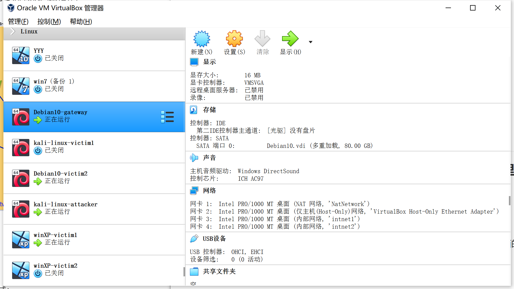

  

  ### 2.对虚拟硬盘多重加载进行配置

  在VirtualBox虚拟机管理里面找到虚拟介质管理，选中需要的虚拟盘，将属性里面的类型项修改为多重加载

  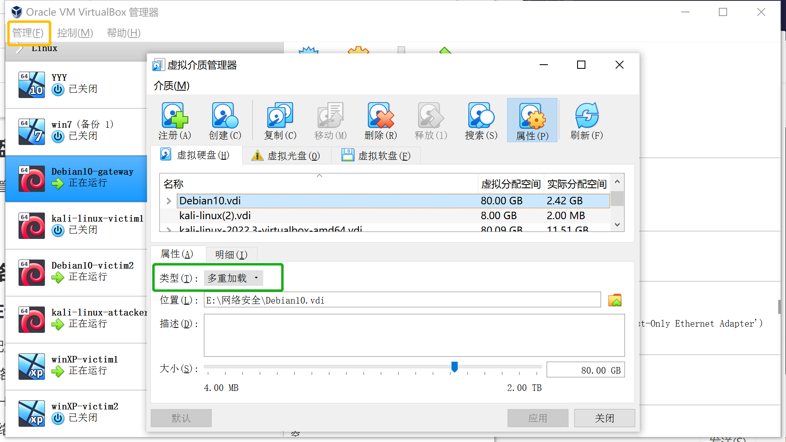
  


### 3.配置每个虚拟机的网络拓扑

#### 在设置中进行每台虚拟机的网卡的配置

（1）网关：

第一块：NAT网络；

第二块：主机（Host-Only）网络；

第三块：内部网络intnet1，搭建局域网1；

第四块：内部网络intnet2，搭建局域网2。

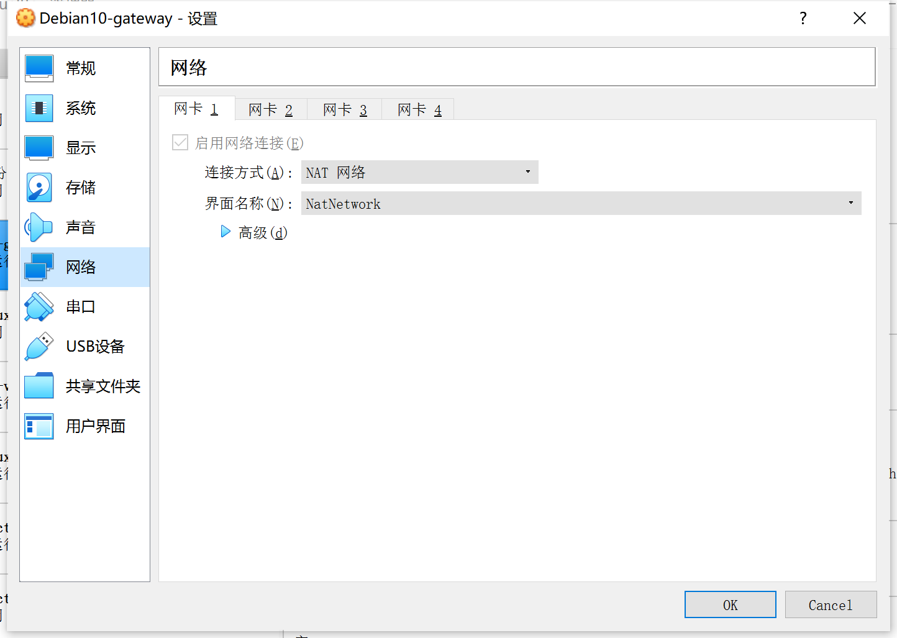

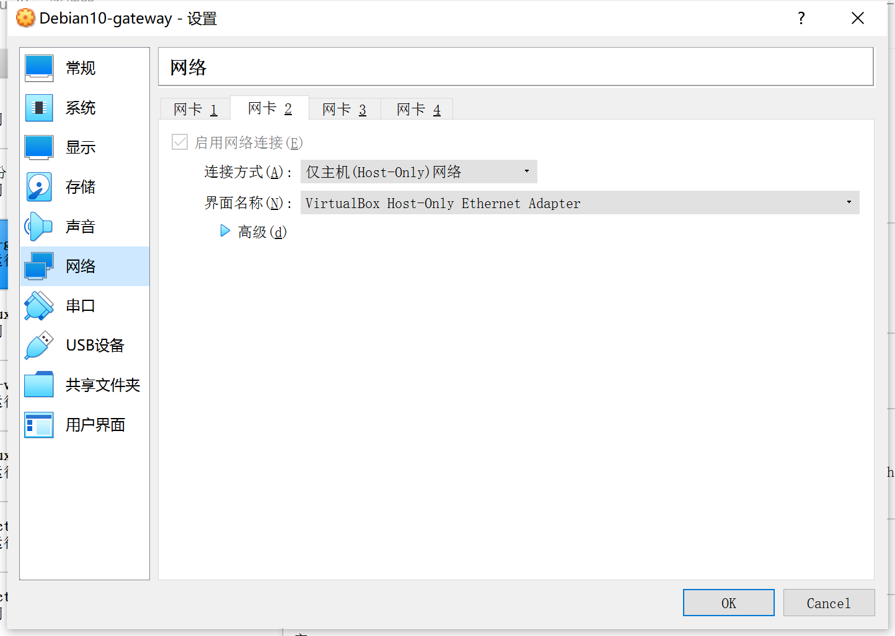


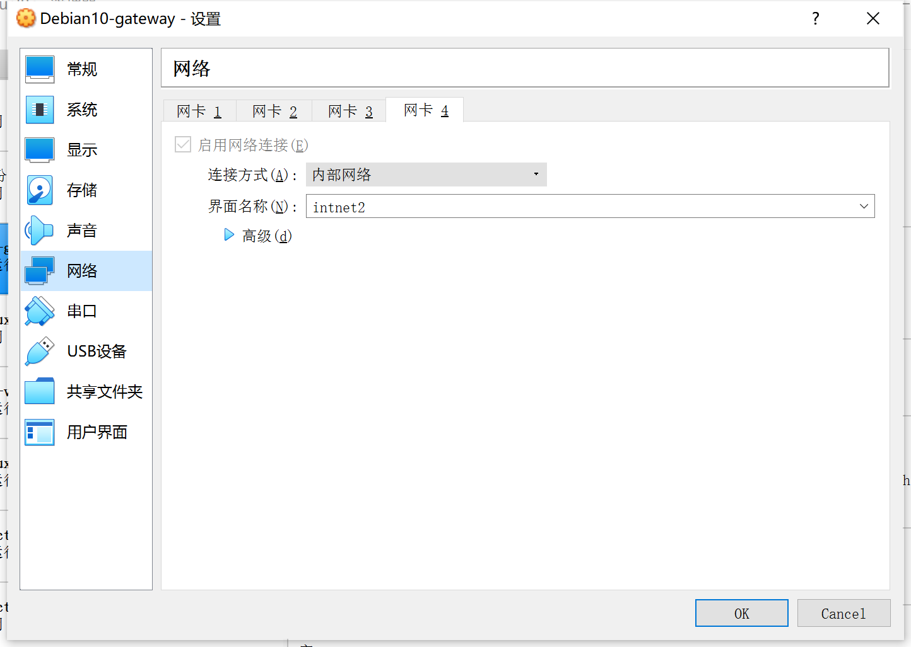

(2)攻击者(Attacker):

第一块：NAT网络；

第二块：主机（Host-Only）网络；

第三块：主机（Host-Only）网络(与第二块不一样)。

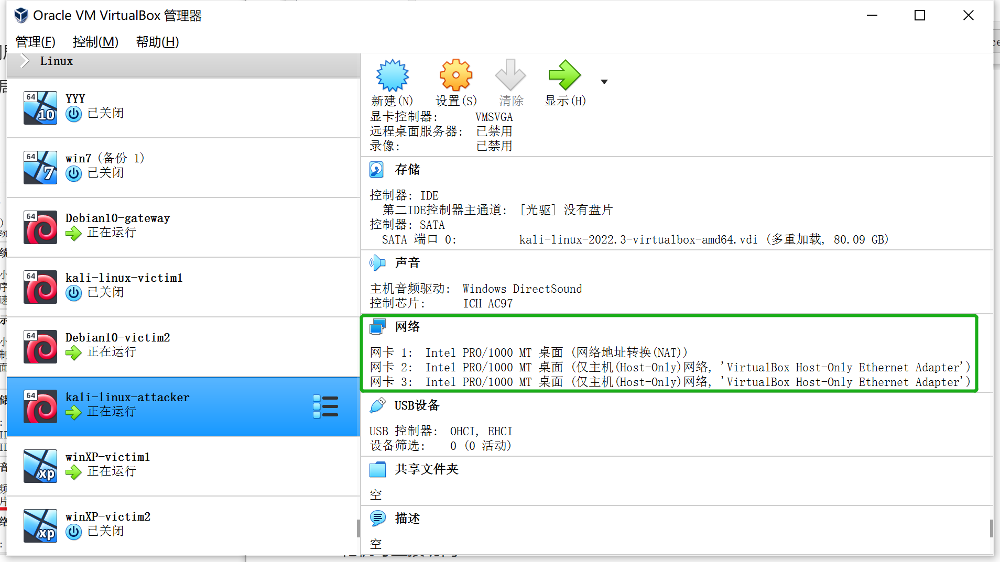

(3)其他的实验受害主机都只需要一块网卡

分为两组，使得不同的实验受害主机在不同的局域网里；

Windows xp1 与 kali 2号在第一局域网（intnet1）；

 

Windows xp2 与 debian 2号在第二局域网（intnet2）;

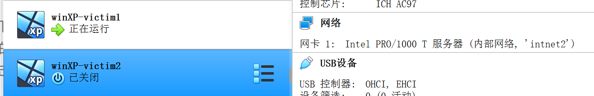


### 4.开始进行主机间的互联

网关使用了NAT模式。该实验中，靶机ping攻击者，ICMP Echo Request在经过网关时，网关会将src ip改为自己的外网IP。攻击者发回的ICMP Echo Reply在经过网关时，src ip又会被网关转换攻击者的IP，所以靶机看就是“能ping通攻击者”

靶机在内部局域网中使用的是虚拟ip地址，即仅内部网络可用的地址，除本局域网以外的机器访问是无效的，因此，攻击者无法对其进行访问

(1)测试第一局域网内的主机与Attacker的连通性

靶机可直接访问Attacker;

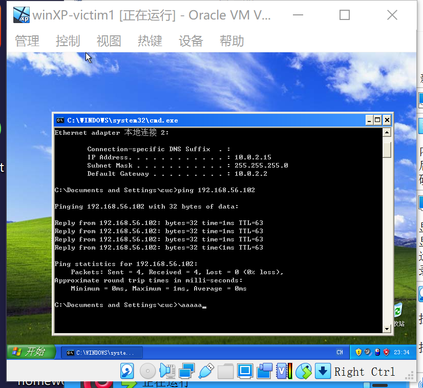

Attacker不可直接访问靶机;

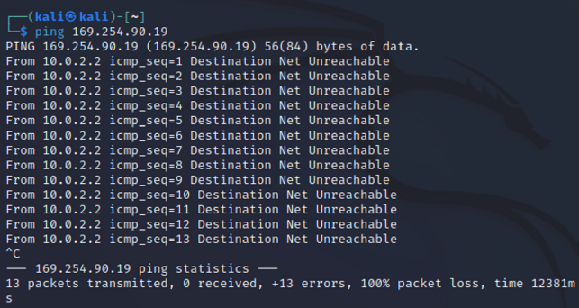

(2)测试第二局域网内的主机与Attacker的连通性

靶机可直接访问Attacker;

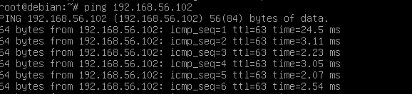

Attacker不可直接访问靶机;

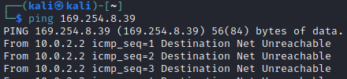

（3）测试网关可以直接访问攻击者主机和靶机

网关访问Attacker；

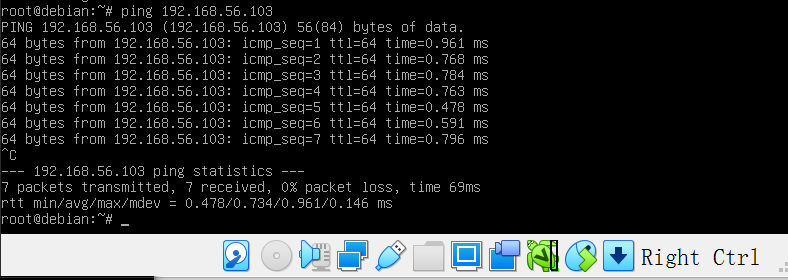

网关访问第一局域网的靶机；

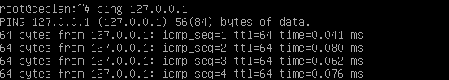

网关访问第二局域网的靶机；

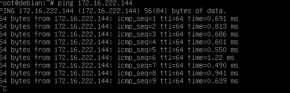


### 5.验证靶机的所有对外上下行流量必须经过网关

靶机对外上网需通过网关获取mac地址，再根据指定的ip地址进行转发包。所以让靶机与互联网进行互相联通，在互相联通的过程中用网关进行抓包，如果靶机发送的所有包都能被网关抓到，则说明靶机的所有对外上下行流量必须经过网关。

(1)第一局域网（intnet1）靶机

联通互联网并用网关抓包

抓包语句：`sudo tcpdump -c 5`

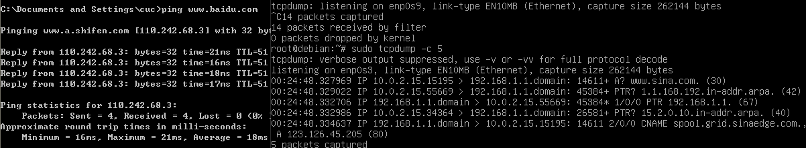

(2)第二局域网（intnet2）靶机

联通互联网并用网关抓包

抓包语句：`sudo tcpdump -c 5`


(3)抓包数据文件复制到主机用WireShark分析

```
# 安装tcpdump
apt install tcpdump
apt update && apt install tmux
# 抓包
cd workspace
tcpdump -i enp0s9 -n -w 20220818.1.pcap
```

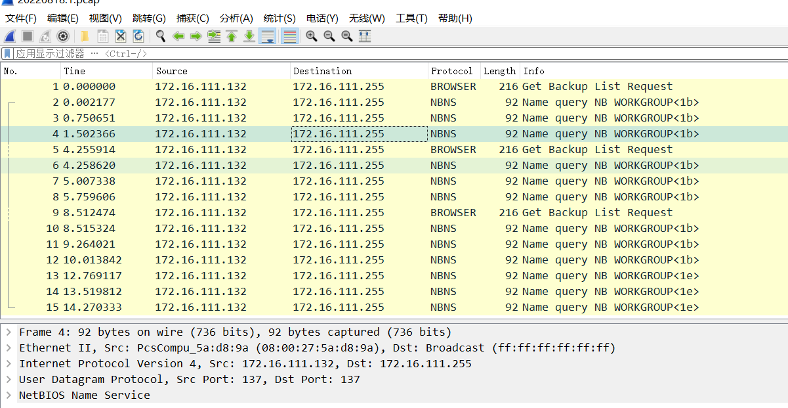


### 6.所有节点均可以访问互联网

(1)攻击者(Attacker)可正常访问互联网

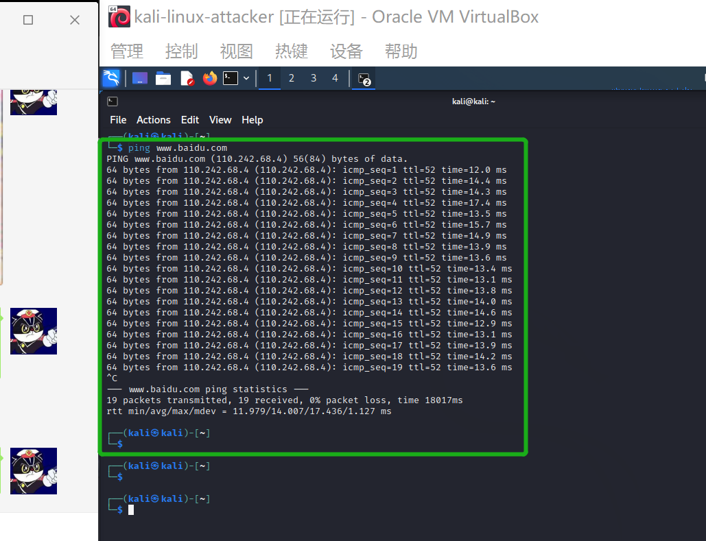

(2)第一局域网靶机可正常访问互联网

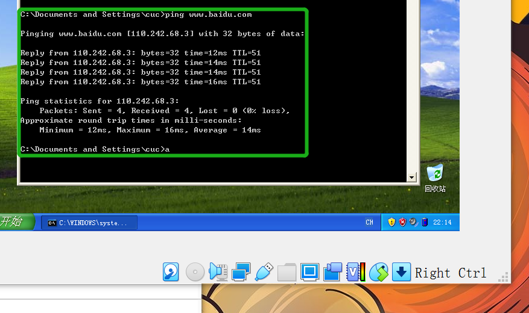

(3)第二局域网靶机可正常访问互联网

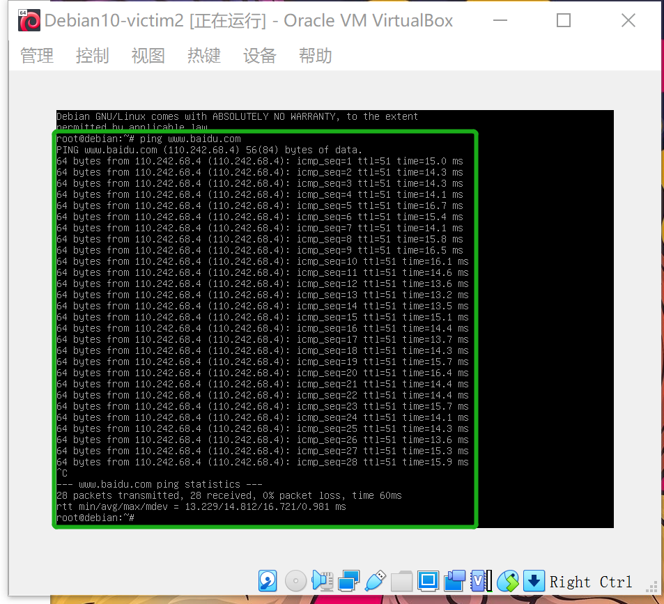

(4)网关可正常访问互联网

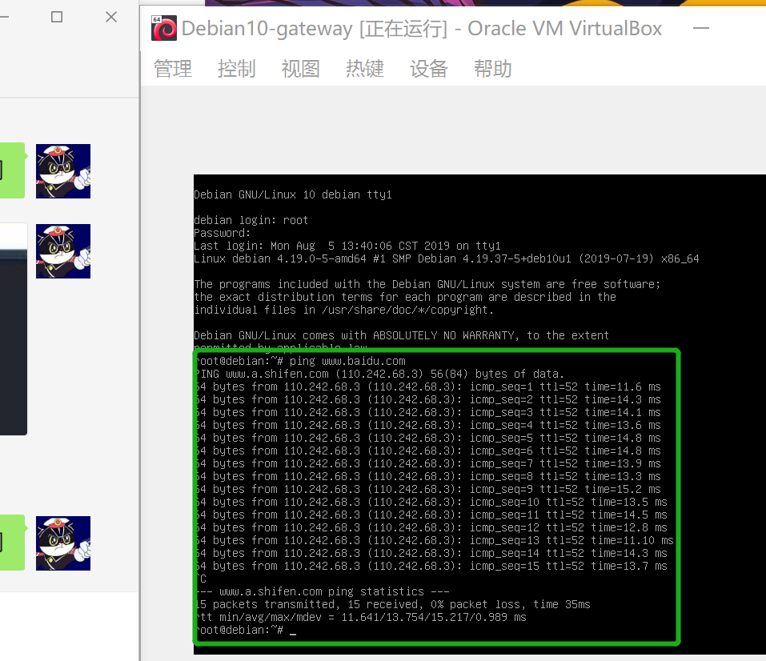


## 实验遇到的问题与解决方案

1、Virtualbox网络连接方式选择NAT网络，无法指定界面名称的解决方法

解决：管理 -> 全局设定 -> 网络 -> 新增，选择界面名称后，刷新 mac 地址


网址：https://blog.csdn.net/hexf9632/article/details/110197530

2、选择启动虚拟机后，出现不能为虚拟电脑打开一个新任务的报错

解决：使用管理员身份运行Oracle VM VirtualBox，在属性-——兼容性——更改所以用户设置——以管理员身份运行此程序，即可成功解决报错弹窗(部分网友需要电脑重新启动才能解决)

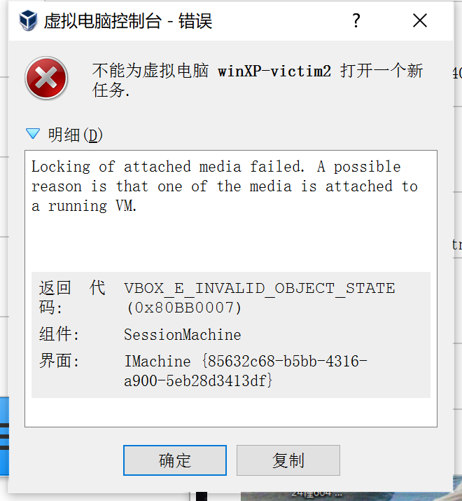

网址：https://blog.csdn.net/weixin_72618867/article/details/126284928

3、在实验过程中虚拟机无法正常打开的问题

解决：彻底删除掉所有文件后，重新导入就好了，导入时注意清空原有盘片，或者重启就可以了，你懂的，重启重装总是很好的选择，可以有效治疗电脑的抽风

4、在进行主机互联时总是ping不通的问题

解决：进行百度等资料后发现关闭防火墙是有效的解决方案

网址：https://mbd.baidu.com/ma/s/nShWHTqN


## 参考链接

[网卡配置](https://blog.csdn.net/hexf9632/article/details/110197530)

[Virtualbox网络连接方式选择NAT网络，无法指定界面名称的解决方法](https://blog.csdn.net/hexf9632/article/details/110197530)

[选择启动虚拟机后，出现不能为虚拟电脑打开一个新任务的报错](https://blog.csdn.net/weixin_72618867/article/details/126284928)

[virtual box安装Linux系统并关闭防火墙](https://mbd.baidu.com/ma/s/nShWHTqN)

